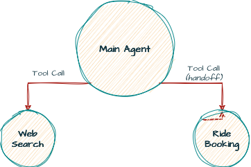

# Simple Agent

A simple Zalo bot agent capable of using tools such as web search and Grab ride booking, built to help my parents.

*[Work in Progress]*

## Quick Demo

This demo showcases a proof-of-concept implementation of the <ins>ride booking feature</ins>.

_(Click the preview image below to watch the full video)_

    

## System Overview

Below is a simplified high-level system diagram.

    

## Prerequisites

- An LLM API key (GLM, Gemini, or Claude). Support for other providers can be added as needed.

## Installation & Usage

- Installation and usage instructions are still in progress (*maybe someday*). In the meantime, check out the [python-zalo-bot](https://pypi.org/project/python-zalo-bot/) SDK.

## Technical Overview

- **OpenAI Python SDK** as the core agent framework.
- **LiteLLM** for LLM provider routing and cost tracking.
- **PostgreSQL** to store LiteLLM configurations.
- **Zalo API** for interacting with Zalo Bot.
- **Webhook** and **long-polling** supported as communication protocols.
- Short-term, file-based memory backed by SQLite.
- Currently powered by **GLM**, **Gemini**, and **Claude** as the underlying LLMs.

## Tools

- Built-in web search tool.
- Ride booking via a dedicated GUI sub-agent, invoked by the main agent through OpenAI's handoff mechanism.

## Agent Architecture

- One main agent with a single sub-agent dedicated to the ride booking feature.

    

## IDE & AI Coding Tools

- **Cursor** (IDE)
- **Kilocode** (AI coding assistant)

## Learning List

- Async programming in Python.
