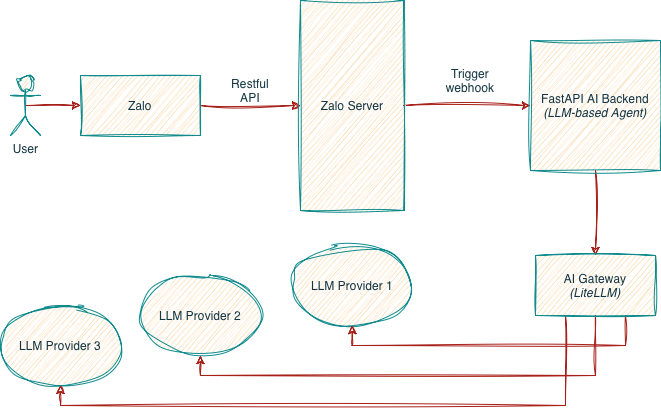

# simple-agent

Like its name, this's an simple Zalo Agent, which is capable of using tools (web-search, Grab ride booking) serving for my parents.

*[WIP]*

### Quick Demo
(_This demo is a proof of concept for ride booking feature_)

<!--> This is the markdown comment <-->

    

### System Overview
_Below is a simplified high-level system diagram_

    

### Prerequistes

- LLM API KEY (GLM, GEMINI or CLAUDE). It can be extended on your demands.

### Installation & Usage

- I am working on it (*maybe*). But I think you should give a quick look to [python-zalo-bot](https://pypi.org/project/python-zalo-bot/) SDK first :)

### Technical Overview

- **OpenAI Python SDK**.
- **LiteLLM** for LLM model providers routing & cost tracking.
- **PostgreSQL** database to save LiteLLM configurations.
- **Zalo API** for interating with Zalo Bot.
- *Webhook* vs *Long-Polling* for communication protocol.
- Short-term file-based memory with SQLite database.
- Currently, I am using **GLM**, **Gemini** and **Claude** as LLM models under the hood.

### Tools

- Built-in web search tool.
- Ride booking with a dedicated GUI agent (sub-agent), which is invoked by the main primary agent through the OpenAI's handoff mechanism.

### Agent Patterns

- One main agent along with only one sub-agent for ride booking feature

### IDE & AI coding agent

- Cursor _(IDE)_
- Kilocode _(AI coding assistant)_

### Learning List

- Async in Python.

